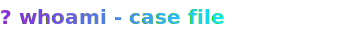

<p align="center">
  
</p>

<h2 align="center">Abhijeet Ingle · nyxragon</h2>

<p align="center">
  
  
  
  
</p>

<p align="center"></p>

## [PROFILE MAP]

```mermaid
graph LR
  subgraph Person
    A[nyxragon / Security Researcher]
  end

  subgraph Companies
    H[HackerOne]
    Z[ZERON]
    S[Securityium]
    V[VTF]
  end

  subgraph Skills
    AI[AI Red Teaming]
    ASM[ASM / EASM]
    PENT[Pentesting]
    LLM[LLM Security]
    DET[Detection Eng]
    CLOUD[Cloud Security]
  end

  subgraph Projects
    CVE1["CVE-2024-7739"]
    CVE2["CVE-2024-7738"]
    PIIS["PIIScout"]
  end

  A --> H
  A --> Z
  A --> S
  A --> V
  Z --> PIIS
  Z --> LLM
  H --> PENT
  H --> DET
  A --> AI
  A --> ASM
  A --> LLM
  A --> CLOUD
  A --> PENT
  A --> DET
  CVE1 --> A
  CVE2 --> A
  style A fill:#1e1b4b,stroke:#8A2BE2,stroke-width:2px
  style H fill:#0d1117,stroke:#00F5FF
  style Z fill:#0d1117,stroke:#00F5FF
  style S fill:#0d1117,stroke:#00F5FF
  style V fill:#0d1117,stroke:#00F5FF
  style CVE1 fill:#0d1117,stroke:#22d3ee
  style CVE2 fill:#0d1117,stroke:#22d3ee
  style PIIS fill:#0d1117,stroke:#22d3ee
```



<p align="left">
  
</p>

## [SUBJECT]

```ts
const whoami = {
  handle: "nyxragon",
  role: "security researcher",
  tagline: "breaking modern systems and rebuilding them stronger",

  intersection: [
    "AI Red Teaming & LLM security",
    "Attack Surface Management (ASM / EASM)",
    "Cloud security",
    "Web & network exploitation",
    "Detection engineering",
    "Security automation",
  ],

  like: "Pushing AI into security pipelines, mapping unknown attack surfaces, and turning repetitive security work into tooling.",

  mantra: [
    "Break things.",
    "Understand them.",
    "Automate the defense.",
  ],
};
```

<p align="center"></p>

### ▸ OSINT Board

<p align="center">
  
</p>

<p align="center"></p>

<p align="center">
  <picture>
    <source media="(prefers-color-scheme: dark)" srcset="https://raw.githubusercontent.com/nyxragon/nyxragon/output/github-snake-dark.svg">
    <source media="(prefers-color-scheme: light)" srcset="https://raw.githubusercontent.com/nyxragon/nyxragon/output/github-snake.svg">
    
  </picture>
</p>

## [ASSESSED CAPABILITIES]

<p align="center">
  
</p>

<p align="center"></p>

## [KNOWN ASSOCIATIONS]

### 🧾 [HackerOne](https://www.hackerone.com) — Triage Intake Analyst
**`Mar 2025 — Present`**  
`bug bounty` · `triage` · `validation`

> `Case note:` Bug bounty triage, validation, intake.


### 🧾 [ZERON](https://www.linkedin.com/company/securezeron) — R&D Associate
**`Jul 2024 – Jan 2025`**  
`AI integrations` · `ASM` · `offsec tools`

PII Discovery (PIIScout) — showcased at Black Hat MEA Arsenal.

> `Case note:` Built PII detection & fine-tuned org LLM.


### 🧾 [ZERON](https://www.linkedin.com/company/securezeron) — Security Researcher Intern
**`Aug 2023 – Jul 2024`**  
`ASM detection` · `pentesting`


### 🧾 [ZERON](https://www.linkedin.com/company/securezeron) — Intern
**`Apr 2023 – Jul 2023`**  
`pentesting` · `technical content`


### 🧾 [Securityium](https://www.linkedin.com/company/securityium) — Cybersecurity Intern
**`Jan 2023 – Apr 2023`**  
`pentesting` · `lab setup` · `automation`

> `Case note:` Lab setup, automation, pentesting.


### 🧾 [Virtually Testing Foundation](https://www.linkedin.com/company/virtually-testing) — Cybersecurity Engineer Intern
**`May 2022 – Jul 2022`**  
`security engineering`

<p align="center"></p>

## [CURRENT FOCUS]

- researching AI abuse cases  
- building small offensive tools  
- exploring attack surfaces  
- cloud security  
- automating security workflows  

> **Want to know more about me?** → [Resume](#)

<p align="center"></p>

## [DIGITAL FOOTPRINT]

<p align="center">
  
  
</p>

<p align="center">
  
  
</p>

<p align="center"></p>

## [ARTIFACT]

<p align="center">
  
</p>

<p align="center"></p>

## [CONTACT]

<p align="center">
  <a href="https://www.linkedin.com/in/nyxragon/">
    
  </a>
  <a href="https://x.com/nyxragon">
    
  </a>
  <a href="https://discordapp.com/users/821296505817530368">
    
  </a>
</p>
